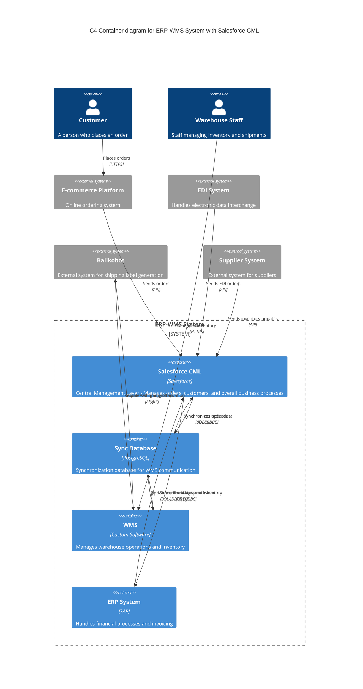
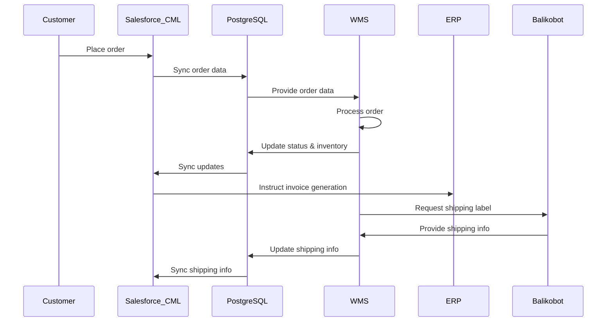
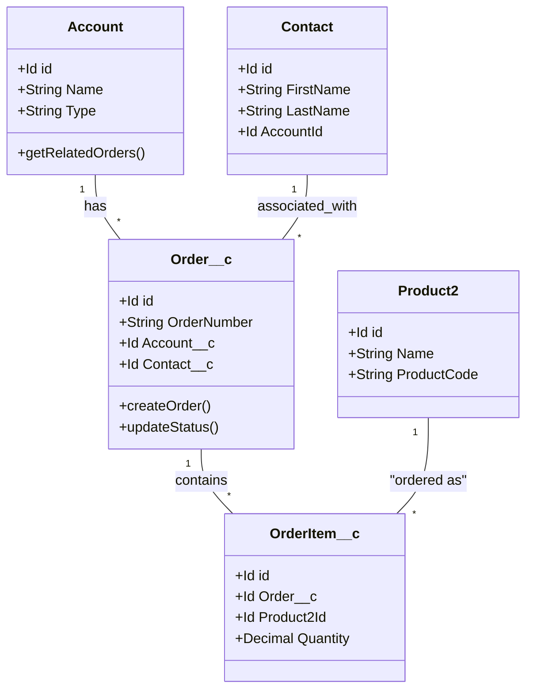
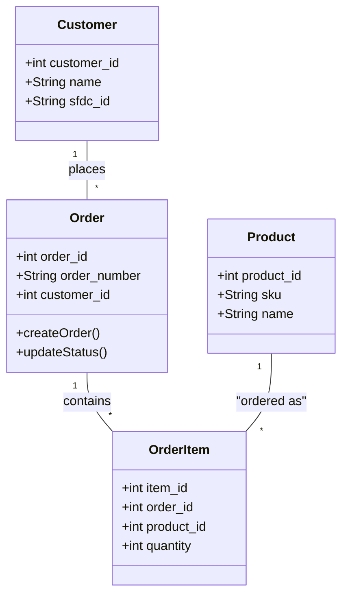

# ERP-WMS System with Salesforce CML Integration

## Table of Contents
1. [Introduction](#1-introduction)
2. [System Architecture](#2-system-architecture)
3. [Key Components](#3-key-components)
4. [Key Processes](#4-key-processes)
5. [Data Model](#5-data-model)
6. [Synchronization and Data Flow](#6-synchronization-and-data-flow)
7. [Integration Points](#7-integration-points)
8. [Reporting and Analytics](#8-reporting-and-analytics)
9. [Security and Compliance](#9-security-and-compliance)
10. [Future Enhancements](#10-future-enhancements)

## 1. Introduction

This document provides a comprehensive overview of our integrated ERP-WMS (Enterprise Resource Planning - Warehouse Management System) solution, which utilizes Salesforce as the Central Management Layer (CML). The system is designed to streamline order processing, inventory management, and logistics operations across multiple platforms.

## 2. System Architecture

Our ERP-WMS system consists of several key components:

- Salesforce CML (Central Management Layer)
- PostgreSQL Synchronization Database
- WMS (Warehouse Management System)
- ERP (Enterprise Resource Planning)
- External Systems (e.g., Balikobot for shipping)

### High-Level Architecture Diagram

## 3. Key Components

### 3.1 Salesforce CML
- Serves as the primary data management and business logic layer
- Handles order creation, customer management, and initial order processing
- Utilizes standard Salesforce objects (Account, Contact) and custom objects for order management

### 3.2 PostgreSQL Synchronization Database
- Acts as an intermediary between Salesforce CML and WMS
- Stores a subset of Salesforce data relevant for WMS operations
- Facilitates data synchronization and transformation between systems

### 3.3 WMS (Warehouse Management System)
- Manages inventory, picking, packing, and shipping processes
- Receives order data from the synchronization database
- Updates order status and inventory levels

### 3.4 ERP System
- Handles financial aspects, including invoicing
- Receives instructions from Salesforce CML for invoice generation
- Manages supplier relationships and purchase orders

## 4. Key Processes

### 4.1 Order Processing Flow

1. Order placed in Salesforce CML (via e-commerce, manual entry, EDI, etc.)
2. Order data synchronized to PostgreSQL database
3. WMS retrieves order data for processing
4. WMS updates order status and inventory levels
5. Status updates synchronized back to Salesforce CML
6. Salesforce CML instructs ERP to generate invoice upon order completion

### 4.2 Inventory Management
1. WMS manages real-time inventory levels
2. Inventory updates synchronized to PostgreSQL database
3. Salesforce CML retrieves inventory data for business operations

### 4.3 Shipping Integration
1. WMS prepares shipments based on order data
2. Integration with Balikobot for shipping label generation
3. Shipping information updated in WMS and synchronized back to Salesforce CML

## 5. Data Model

### 5.1 Salesforce CML Data Model

Key entities in Salesforce CML:
- Account (standard Salesforce object)
- Contact (standard Salesforce object)
- Order__c (custom object)
- OrderItem__c (custom object)
- Product2 (standard Salesforce object)

### 5.2 PostgreSQL Synchronization Database Model

Key entities in PostgreSQL database:
- Customer (minimal information, linked to Salesforce Account)
- Order
- OrderItem
- Product

## 6. Synchronization and Data Flow

### 6.1 Salesforce to PostgreSQL
- Orders and related data pushed from Salesforce to PostgreSQL
- Scheduled jobs and real-time triggers ensure timely data synchronization

### 6.2 PostgreSQL to WMS
- WMS retrieves order and product data from the PostgreSQL database
- WMS processes the retrieved data within its own system
- WMS writes back processed data to the PostgreSQL database
- This bidirectional flow ensures that the PostgreSQL database always contains the most up-to-date information from WMS operations

### 6.3 PostgreSQL to Salesforce CML
- Salesforce CML retrieves data from the PostgreSQL database
- This includes updated order statuses, inventory levels, and other relevant information processed by WMS
- Salesforce CML processes and integrates this data within its own system

## 7. Integration Points

- Salesforce API: Used for data exchange between Salesforce and external systems
- PostgreSQL Database: Serves as the central point for data synchronization
- WMS Integration: WMS reads from and writes to the PostgreSQL database, facilitating data exchange with other system components
- ERP Integration: Salesforce CML communicates with ERP for invoicing and financial processes
- Balikobot Integration: 
  - Integrated with WMS for shipping label generation and tracking
  - Utilizes Salesforce CML for retrieving shipment statuses, ensuring up-to-date tracking information is available across the system

## 8. Reporting and Analytics

- Salesforce provides built-in reporting and dashboard capabilities for operational insights
- ERP generates financial reports and analytics
- Comprehensive and complex reports are generated through a data warehouse and visualized using PowerBI
  - The data warehouse integrates data from all system components (Salesforce CML, WMS, ERP)
  - PowerBI provides advanced data visualization and analysis capabilities
  - This approach allows for in-depth, cross-system analytics and business intelligence
- The centralized reporting structure ensures consistent and accurate reporting across the entire organization
- Real-time and historical data analysis is possible, supporting both operational and strategic decision-making

## 9. Security and Compliance

- Salesforce provides robust security features, including user authentication and field-level security
- Data encryption in transit and at rest for sensitive information
- Regular security audits and compliance checks
- GDPR compliance measures implemented across all systems

## 10. Future Enhancements

- AI-powered demand forecasting integration
- Mobile app for warehouse operations
- Enhanced customer portal for real-time order tracking
- Integration with additional shipping providers
